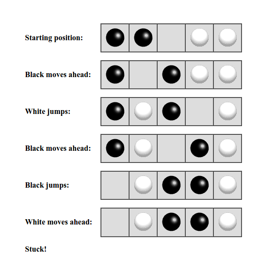

##### Cindy's Puzzle in JAVA with backtracking:

You have some number n of black marbles and the same number of white marbles, and you have a playing board which consists simply of a line of 2n+1 spaces to put the marbles in. Start with the black marbles all at one end (say, the left), the white marbles all at the other end, and a free space in between.

The goal is to reverse the positions of the marbles:

The black marbles can only move to the right, and the white marbles can only move to the left (no backing up). At each move, a marble can either:

* Move one space ahead, if that space is clear, or
* Jump ahead over exactly one marble of the opposite color, if the space just beyond that marble is clear.

For example, you could make the following sequence of moves:

[See here.]( https://www.cis.upenn.edu/~matuszek/cit594-2012/Pages/backtracking.html)

